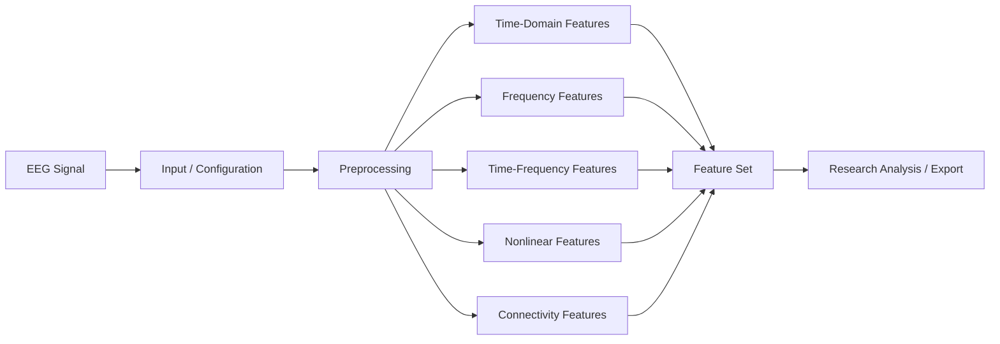

# EEG Epilepsy Feature Extraction & Signal Analysis

<p align="center">
  <strong>Research-oriented EEG preprocessing and feature-engineering workspace</strong>
</p>

<p align="center">
  
  
  
  <a href="https://github.com/shaiksadik1725-droid/EEG_EPILEPSY/actions/workflows/python-syntax.yml"></a>
</p>

## Project at a Glance

| Item | Details |
|---|---|
| Domain | Biomedical signal processing |
| Focus | EEG feature extraction |
| Primary use case | Epilepsy / seizure-oriented research workflow |
| Interface | Flask backend + browser UI |
| Feature groups | Time, frequency, time-frequency, nonlinear, connectivity |
| Status | Academic / research prototype |

## Overview

The application organizes EEG analysis into a structured pipeline that supports signal-oriented experimentation and feature extraction for seizure and epilepsy research.

## Analysis Pipeline



## Feature Groups

### Time Domain
Hjorth parameters, mean, variance, skewness, kurtosis, RMS, zero-crossing rate, entropy measures, and fractal-dimension-related features.

### Frequency Domain
Absolute/relative band power, Welch PSD, FFT PSD, spectral entropy, peak frequency, band-power ratios, and spectral edge frequency.

### Time-Frequency
STFT, DWT, CWT, wavelet-packet features, EMD / IMF features, and related representations.

### Nonlinear & Connectivity
Lyapunov-related measures, correlation dimension, DFA, permutation entropy, Hurst exponent, coherence, PLV, cross-correlation, and graph-oriented metrics.

## EEG Bands

The project includes definitions for delta, theta, alpha, beta, gamma, and higher-frequency activity.

## Technology Stack

- Python
- Flask
- HTML / CSS / JavaScript
- EEG / DSP feature-engineering logic

## Repository Structure

```text
EEG_EPILEPSY/
├── app.py
├── index.html
├── requirements.txt
└── dataset/
```

## Run Locally

```bash
git clone https://github.com/shaiksadik1725-droid/EEG_EPILEPSY.git
cd EEG_EPILEPSY
pip install -r requirements.txt
python app.py
```

## Research Scope

This repository is intended for engineering and research work. It is **not** a clinical diagnostic tool.

## Future Work

- Add validated public EEG datasets
- Integrate MNE / SciPy preprocessing
- Add artifact-removal methods
- Add trained seizure classifiers
- Add reproducible evaluation notebooks
- Export structured feature tables and reports

## Author

**Sadik Shaik**

Computer Engineering · Artificial Intelligence · Biomedical Signal Processing
